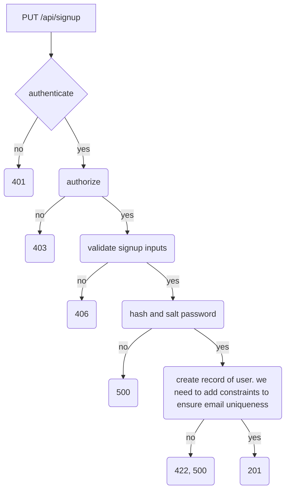

```mermaid
graph TD
    A[PUT /api/signup] --> B{authenticate}
    B --> |no|D(401)
    B --> |yes| E(authorize)
    E --> |no| F(403)
    E --> |yes| G(validate signup inputs)
    G --> |no| H(406)
    G --> |yes| I(hash and salt password)
    I --> |no| J(500)
    I --> |yes| K(create record of user. we need to add constraints to ensure email uniqueness)
    K --> |no| L(422, 500)
    K --> |yes| M(201)
```