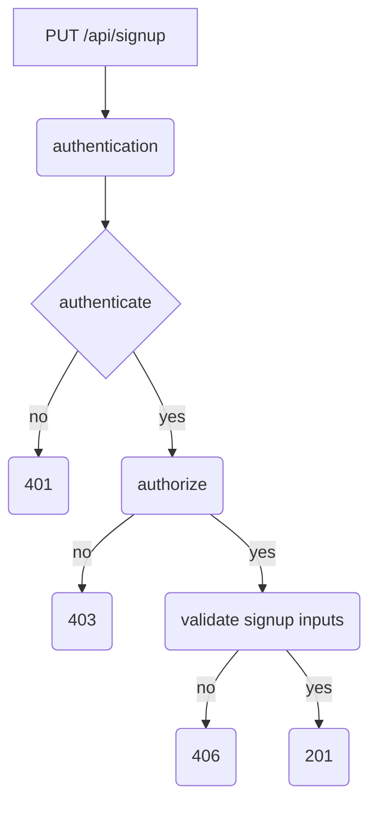

```mermaid
graph TD
    A[PUT /api/signup] --> B(authentication)
    B --> C{authenticate}
    C --> |no|D(401)
    C --> |yes| E(authorize)
    E --> |no| F(403)
    E --> |yes| G(validate signup inputs)
    G --> |no| H(406)
    G --> |yes| I(201)
```